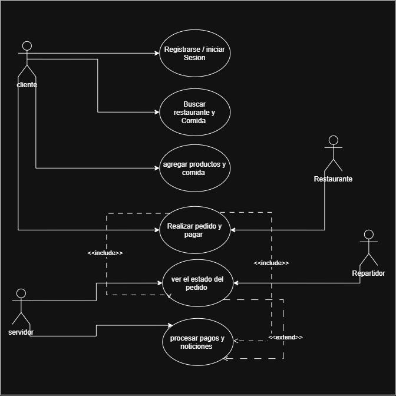

 # Diagrama de Casos de Uso - DILIVIRI

## 1. Representación Visual

## 2. Actores

### Cliente

Es la persona que utiliza la aplicación DILIVIRI para consultar restaurantes, seleccionar productos, realizar pedidos y consultar el estado de sus órdenes.

### Restaurante

Recibe los pedidos realizados por los clientes y puede gestionar la preparación de los pedidos.

### Repartidor

Se encarga de recoger los pedidos preparados por el restaurante y entregarlos al cliente.

### Servidor / API

Procesa las solicitudes de la aplicación móvil y gestiona la información necesaria para el funcionamiento del sistema.

## 3. Casos de uso principales

### Registrarse / Iniciar sesión

Permite al cliente crear una cuenta o ingresar a su cuenta existente.

### Buscar restaurantes y comida

Permite al cliente consultar los restaurantes y productos disponibles.

### Agregar productos al carrito

Permite seleccionar productos y agregarlos al carrito antes de realizar el pedido.

### Realizar pedido y pagar

Permite confirmar los productos seleccionados, indicar la dirección de entrega y completar el proceso de pago.

### Ver estado del pedido

Permite al cliente consultar el estado actual de su pedido.

### Gestionar pedidos

Permite al restaurante aceptar o rechazar los pedidos recibidos.

### Recoger y entregar pedido

Permite al repartidor gestionar la entrega del pedido hasta el cliente.

## 4. Relaciones <<include>> y <<extend>>

La relación <<include>> representa una funcionalidad que forma parte obligatoria de otra.

En DILIVIRI, el caso de uso "Realizar pedido y pagar" incluye "Seleccionar dirección de entrega" y "Procesar pagos y notificaciones".

La relación <<extend>> representa una funcionalidad opcional o condicionada.

En DILIVIRI, "Aplicar cupón de descuento" puede extender "Realizar pedido y pagar", mientras que "Calificar pedido" puede extender "Ver estado del pedido".

## 5. Objetivo del sistema

El objetivo de DILIVIRI es facilitar el proceso de solicitud y entrega de comida mediante una aplicación móvil que conecta clientes, restaurantes y repartidores.
