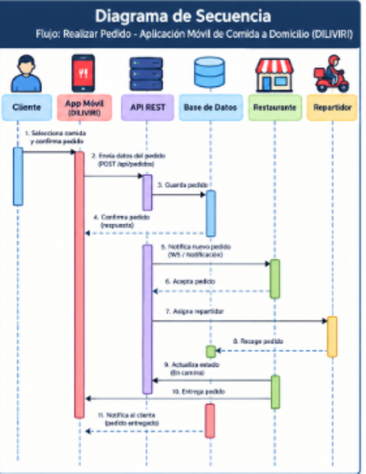

 # Diagrama de Secuencia - Realizar Pedido

## 1. Diagrama de Interacción

## 2. Descripción del flujo

El siguiente flujo representa el proceso que ocurre cuando un cliente realiza un pedido de comida mediante DILIVIRI.

### Paso 1: Selección del pedido

El cliente selecciona los productos que desea comprar y confirma el pedido desde la aplicación móvil.

### Paso 2: Envío del pedido

La aplicación móvil envía los datos del pedido al servidor mediante una solicitud a la API REST.

### Paso 3: Registro del pedido

La API procesa la solicitud y almacena la información del pedido en la base de datos.

### Paso 4: Confirmación

La base de datos devuelve la información correspondiente y la API confirma el registro del pedido a la aplicación móvil.

### Paso 5: Notificación al restaurante

El sistema notifica al restaurante que existe un nuevo pedido.

### Paso 6: Aceptación del pedido

El restaurante revisa y acepta el pedido para comenzar su preparación.

### Paso 7: Asignación del repartidor

El sistema asigna un repartidor para recoger y entregar el pedido.

### Paso 8: Recogida

El repartidor recoge el pedido preparado en el restaurante.

### Paso 9: Actualización del estado

El sistema actualiza el estado del pedido para que el cliente pueda consultar su progreso.

### Paso 10: Entrega

El repartidor lleva el pedido hasta la dirección indicada por el cliente.

### Paso 11: Notificación final

El sistema actualiza el pedido como entregado y notifica al cliente.
